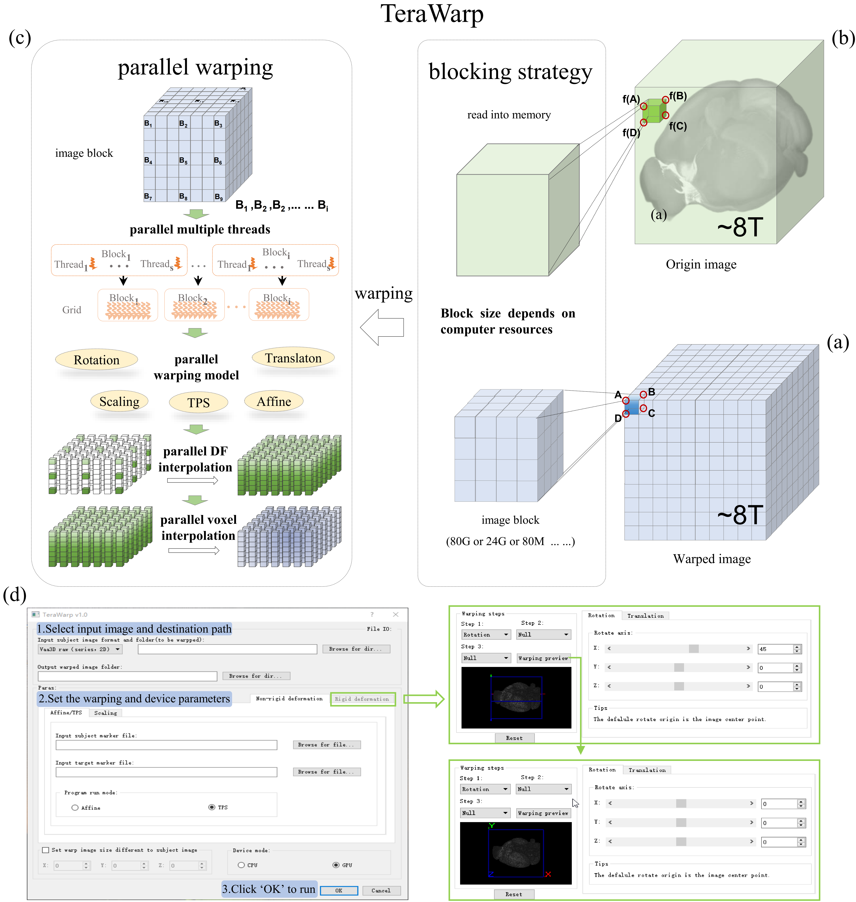

# TeraWarp: Fast Terabyte-Scale Volumetric Image Warping Tool

# Contents
- [System requirements](#System-requirments)
  - [Required device](#Required-device)
  - [Optional device](#Optional-device)
- [Installation](#Installation)
- [Run TeraWarp](#Run-TeraWarp)
- [License](#license)

# System requirments
TeraWarp works on desktop computers, for terabyte-scale data, our recommended computer configurations for efficiency gains are as follows:

## Required device
RAM: 64GB or larger

CPU: 2.3GHz Intel Xeon Gold or better

Hard disk: Three times the size of the original image or larger

## Optional device
GPU: NVIDIA GeForce RTX 3090 GPU or better

(Note: The time required for image warping is closely related to GPU, and we recommend using GPU to process the image.)

# Installation

# Run TeraWarp

# License

